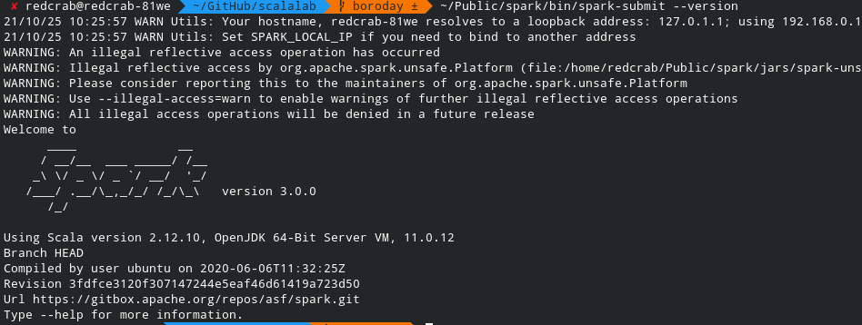
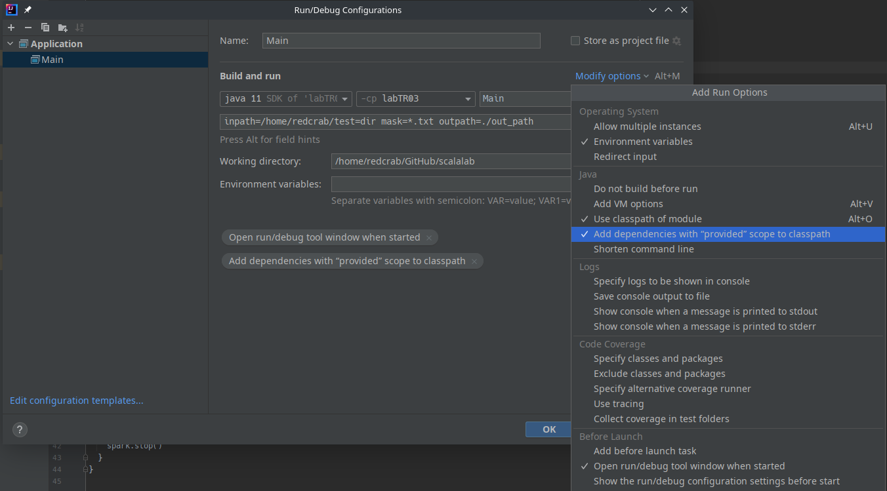

### Версии

В проекте используется scala версии 2.12.12, spark core 2.4.8, spark sql 2.4.8. Для добавления зависимостей к своему модулю  см  build.sbt, делай по аналогии. На скриншоте ниже продемонстрирована проверка версии spark.



## Сборка

В версиях указан параметр "provided", эти значит, что зависимости будут представлены средой выполнения, т.е. spark-ком, поэтому важно, чтобы spark был с нужной версией scala. На скриншоте ниже продемонстрирована верная настройка конфигурации для запуска из IDE.
[Найти](https://spark.apache.org/downloads.html) нужно версию можно на офф сайте, главное, чтобы переменная окружения SPARK_HOME указывал на нужную версию.




## Команды

Сборка проекта: 
```shell
sbt package
```
Запуск результата: 
```
spark-submit --class Main --master local scalalab/lab-tr03/target/scala-2.12/labtr03_2.12-0.1.0.jar inpath=/home/test=dir mask=\*.txt outpath=./out_path
```


